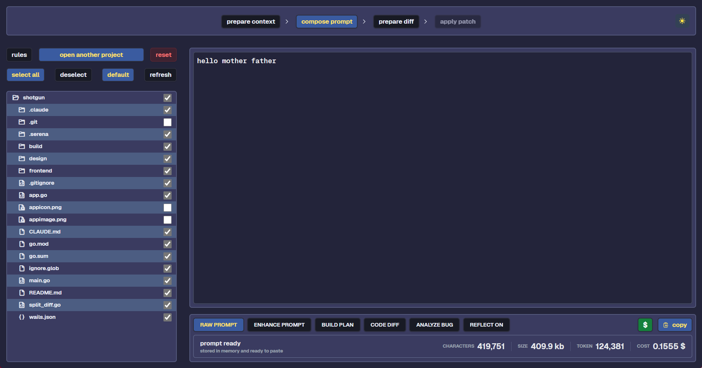
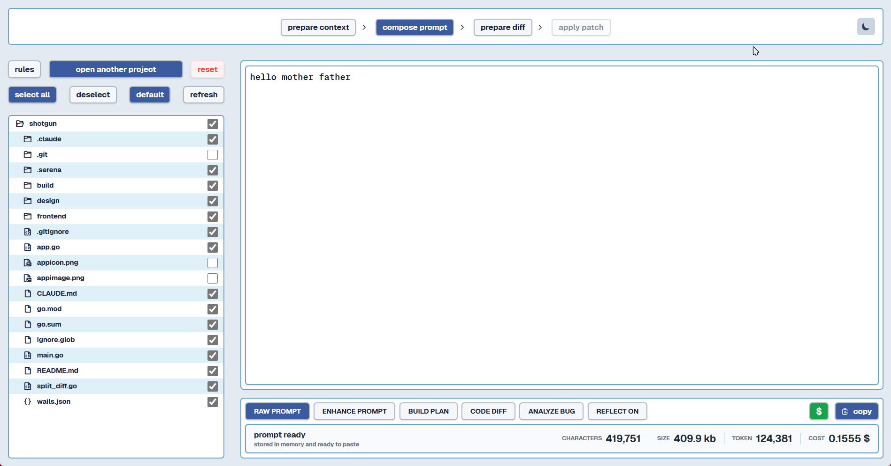

# shotgun


*dark mode interface*


*light mode interface*


## what is shotgun ?

shotgun is a tool for streamlined prompt engineering and preparation. it provides a user-friendly interface for crafting prompts, managing context, and analyzing token usage with ai models.

## requirements

- go 1.24.0 or higher
- node.js and pnpm for frontend development
- google api key for gemini token counting

## setup

### google api key for gemini token counting

to use the accurate gemini token counting feature, you need to set up your google ai api key:

1. obtain an api key from [google ai studio](https://ai.google.dev/)
2. set the environment variable before running the application:

on windows (powershell):
```
$env:GOOGLE_API_KEY = "your-api-key"
```

on unix-like systems (bash):
```
export GOOGLE_API_KEY="your-api-key"
```

note: gemini integration is used exclusively for accurate token counting. no actual ai model execution occurs within the application. the application will fall back to displaying an error message if the api key is not set or invalid.

## development

### running in development mode

```
wails dev
```

### building

```
wails build
```

## features

- accurate gemini token counting using the official google ai sdk (for analysis only)
- file tree visualization with gitignore support
- customizable prompt templates
- live token counting and validation
- clipboard integration
- simulated prompt execution workflow for demonstration purposes

**important note**: prompt execution in step 3 is simulated for demonstration purposes only. the application focuses on prompt preparation and token analysis without actual ai model execution.

## prompt modes

shotgun provides six specialized prompt modes for different ai workflows:

- **raw prompt** (`RAW PROMPT`): custom query mode with minimal structure - provides your task and rules directly to the ai without specialized formatting

- **enhance prompt** (`ENHANCE PROMPT`): automatically enriches and clarifies vague prompts by adding context, constraints, and technical specificity from codebase analysis

- **build plan** (`BUILD PLAN`): strategic planning mode for architecture, refactoring, or system design - generates comprehensive, actionable project plans with phases and milestones

- **code diff** (`CODE DIFF`): development mode for implementing features, fixes, or modifications - outputs precise git diff formatted code changes

- **analyze bug** (`ANALYZE BUG`): debugging analysis mode that traces execution paths, identifies root causes, and provides detailed bug analysis reports with actionable insights

- **reflect on** (`REFLECT ON`): project documentation and synchronization mode - analyzes codebase state and generates documentation updates for architecture and task tracking
